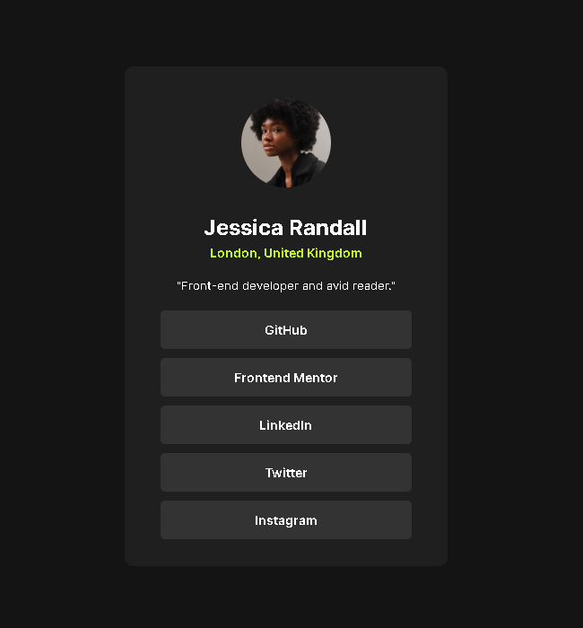

# Frontend Mentor - Solução de Perfil de Links Sociais

Esta é a minha solução para o desafio  [Social links profile challenge on Frontend Mentor](https://www.frontendmentor.io/challenges/social-links-profile-UG32l9m6dQ) do Frontend Mentor.  
Os desafios do Frontend Mentor ajudam a aprimorar habilidades de codificação através da criação de projetos realistas e focados em boas práticas de desenvolvimento.

## 🗂️ Índice

- [Visão Geral](#visão-geral)
  - [Captura de Tela](#captura-de-tela)
  - [Links](#links)
- [Meu Processo](#meu-processo)
  - [Construído com](#construído-com)
  - [O que Aprendi](#o-que-aprendi)
  - [Desenvolvimento Contínuo](#desenvolvimento-contínuo)
- [Autor](#autor)
- [Contato](#contato)

---

## 📋 Visão Geral

### Captura de Tela

### Links

- URL do site publicado: [Clique aqui](https://guilherme-ddiniz.github.io/social-links-profile-main/)

---

## 🚀 Meu Processo

### Construído com

- HTML5 semântico
- CSS3 com propriedades personalizadas (CSS Variables)
- Flexbox para layout responsivo
- Fluxo de trabalho Desktop-first
- Controle de versão com Git

### O que Aprendi

- Este projeto foi uma oportunidade valiosa para aprofundar meus conhecimentos em HTML5 e CSS3. Também aprimorei minhas práticas de versionamento com Git e otimizei o código, garantindo uma responsividade mais eficiente e proporcionando uma melhor experiência ao usuário.

### Desenvolvimento Contínuo

- Meu objetivo é continuar aprimorando minhas habilidades com Git e GitHub, tornando o versionamento mais ágil e integrado ao fluxo de trabalho. Além disso, busco consolidar e expandir meus conhecimentos em HTML5 e CSS3, com o propósito de desenvolver interfaces modernas, robustas e totalmente responsivas, que ofereçam uma experiência de alta qualidade ao usuário.

---

## 👨‍💻 Autor

- GitHub - [Guilherme-dDiniz](https://github.com/Guilherme-dDiniz)
- Frontend Mentor - [@Guilherme-dDiniz](https://www.frontendmentor.io/profile/Guilherme-dDiniz)
